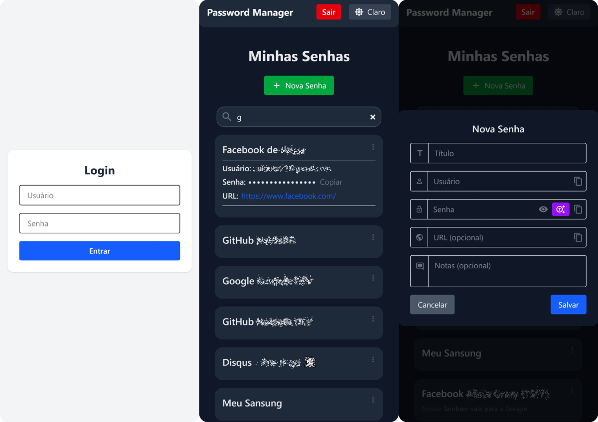

# Password Manager 🔐

Um gerenciador de senhas pessoal, seguro e responsivo, desenvolvido com Node.js, Express, MongoDB, React, TypeScript e Tailwind CSS.

---

## 📦 Tecnologias Utilizadas

- **Backend:**
  - Node.js + Express
  - MongoDB Atlas
  - Mongoose
  - AES-256-CBC (Criptografia)
  - Autenticação via JWT
  - API Key

- **Frontend:**
  - React + Vite
  - TypeScript
  - Tailwind CSS
  - Framer Motion
  - React Icons

---

## ⚙️ Funcionalidades

- Criação, edição, exclusão e visualização de senhas.
- Criptografia AES-256-CBC no backend.
- Login com token JWT.
- Tema claro/escuro com memorização.
- Filtros de pesquisa em tempo real.
- Geração de senhas seguras personalizáveis.
- Copiar dados sensíveis com um clique.
- Design responsivo e minimalista.

---

## 🖼️ Screenshots



---

## 🚀 Como Executar Localmente

### 🔒 Backend

1. Acesse a pasta `backend`:
   ```bash
   cd backend
````

2. Instale as dependências:

   ```bash
   npm install
   ```

3. Crie um arquivo `.env`:

   ```
   MONGO_URI=YOUR_MONGODB_URI
   ENCRYPTION_KEY=YOUR_BASE64_KEY
   JWT_SECRET=YOUR_JWT_SECRET
   API_KEY=YOUR_API_KEY
   ```

4. Rode o backend:

   ```bash
   npm run dev
   ```

---

### 🌐 Frontend

1. Acesse a pasta `frontend`:

   ```bash
   cd frontend
   ```

2. Instale as dependências:

   ```bash
   npm install
   ```

3. Rode o frontend:

   ```bash
   npm run dev
   ```

---

## 📤 Deploy

* **Frontend:** [Vercel](https://vercel.com/)
* **Backend:** [Render](https://render.com/)
* **Banco de Dados:** MongoDB Atlas

---

## 🛡️ Aviso

Este projeto é de uso pessoal. Certifique-se de proteger suas variáveis de ambiente e não expor dados sensíveis ao público.

---

## 🧑‍💻 Autor

Criado por naldobr-dev (https://github.com/naldobr-dev).

